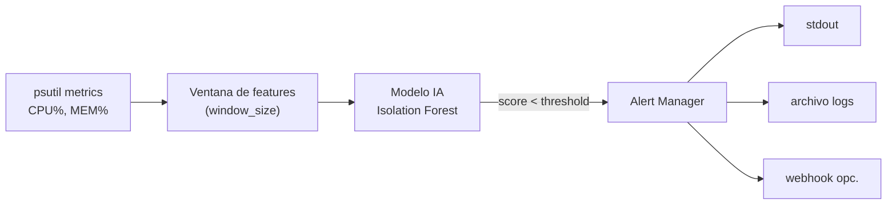

# 🧠 AI SysOps Observability — Detección de anomalías para recursos del sistema

> Sistema **ligero y local** de **observabilidad inteligente** para ingenieros **SysOps**. Monitorea CPU y memoria, **aprende un baseline** y alerta ante **comportamientos anómalos** usando *Isolation Forest*. Ideal para labs, demos y portafolios, **sin dependencias en la nube**.

<p align="left">
  
  
  
  
</p>

---

## ✨ Funcionalidades

* 📊 **Monitoreo** de uso de **CPU** y **memoria (RAM)** en tiempo real
* 🤖 **Detección de anomalías** con **Isolation Forest** (entrenamiento en datos simulados)
* 🧠 **Entrenamiento rápido** de modelo: baseline local vs. ruido/anomalías simuladas
* 🚨 **Alertas** cuando el sistema se desvía del comportamiento esperado
* 🧪 **Modo demo** libre de riesgos: sin AWS, sin root, sin tocar servicios del sistema

---

## 🧭 Flujo de alto nivel



---

## 📂 Estructura

```
.
├─ train_model.py        # Entrena y guarda el modelo (joblib)
├─ monitor.py            # Lee métricas y evalúa el modelo en tiempo real
├─ requirements.txt      # Dependencias
├─ config.example.yml    # (opcional) Config por YAML
├─ .env.example          # (opcional) Config por variables de entorno
└─ README.md
```

> Puedes usar **.env** o **config.yml** (elige uno). Si no existen, se usan **valores por defecto seguros**.

---

## ⚙️ Requisitos

* **Python 3.8+** (recomendado 3.10+)
* **Dependencias**:

  * `scikit-learn`
  * `psutil`
  * `joblib`
  * `numpy`

```bash
python -m venv .venv && source .venv/bin/activate
pip install -r requirements.txt
```

**Ejemplo `requirements.txt`:**

```
scikit-learn>=1.3
psutil>=5.9
joblib>=1.3
numpy>=1.24
PyYAML>=6.0  # si usas config YAML (opcional)
python-dotenv>=1.0  # si usas .env (opcional)
```

---

## 🚀 Uso rápido

```bash
# 1) Instalar dependencias
pip install -r requirements.txt

# 2) Entrenar (genera artifacts/model.joblib)
python train_model.py

# 3) Monitorear en vivo (usa el modelo entrenado)
python monitor.py
```

**Salida esperada (ejemplo):**

```
[train] dataset: 5m baseline + 2% ruido
[train] model: IsolationForest(contamination=0.02)
[train] saved: artifacts/model.joblib

[monitor] tick=12 cpu=23.1% mem=41.8% score=0.27 status=OK
[monitor] tick=13 cpu=92.4% mem=87.9% score=-0.14 status=ANOMALY ⚠️
```

---

## 🔧 Configuración

### Variables de entorno (`.env`)

| Variable          | Descripción                              | Default                  |
| ----------------- | ---------------------------------------- | ------------------------ |
| `MODEL_PATH`      | Ruta del modelo entrenado                | `artifacts/model.joblib` |
| `SAMPLE_INTERVAL` | Intervalo de muestreo (seg.)             | `1.0`                    |
| `WINDOW_SIZE`     | Tamaño de ventana para features          | `30`                     |
| `ALERT_THRESHOLD` | Umbral de score p/ alerta (<0 = anómalo) | `0.0`                    |
| `LOG_PATH`        | Archivo de logs                          | `logs/monitor.log`       |
| `WEBHOOK_URL`     | URL webhook para alertas (opcional)      | *vacío*                  |

### Config YAML (`config.yml`)

```yaml
model_path: artifacts/model.joblib
sample_interval: 1.0
window_size: 30
alert_threshold: 0.0
log_path: logs/monitor.log
webhook_url: ""
```

> **Prioridad sugerida:** flags CLI → variables de entorno → config.yml → defaults.

---

## 🧪 Cómo probar anomalías

**Opción 1 (rápida):** abre temporalmente una carga de CPU en otra terminal:

```bash
python - <<'PY'
import time
x = 0
while True:
  x = (x + 1) % 10**6
  if x==0: time.sleep(0.001)
PY
```

**Opción 2 (Linux):** instala `stress`/`stress-ng` y simula picos (opcional).
**Opción 3:** modifica `monitor.py` para activar un modo `--simulate` (si lo implementas).

> Detén los procesos con `Ctrl+C` cuando termines. No uses en servidores compartidos.

---

## 🧰 CLI sugerida (opcional)

Si decides añadir flags:

```
python train_model.py --minutes 5 --contamination 0.02 --save artifacts/model.joblib
python monitor.py --interval 1.0 --window 30 --threshold 0.0 --log logs/monitor.log
```

---

## 🧯 Troubleshooting

* **No encuentra modelo** → ejecuta `python train_model.py` o revisa `MODEL_PATH`.
* **Permisos en logs** → crea `logs/` y otorga permisos: `mkdir -p logs && chmod 755 logs`.
* **picos falsos de CPU** → sube `WINDOW_SIZE` o ajusta `ALERT_THRESHOLD`.
* **alto uso de CPU del monitor** → incrementa `SAMPLE_INTERVAL`.

---

## 🧪 CI/CD (sugerencia)

* **Lint/format:** `ruff`/`flake8` + `black`
* **Tests:** `pytest` con muestras artificiales
* **Seguridad:** `pip-audit` o `safety`
* Workflow base: `.github/workflows/ci.yml` (instalar deps → lint → tests)

---

## 🗺️ Roadmap

* [ ] Exporter **Prometheus** (métricas `anomaly_score`, `is_anomaly`)
* [ ] Dashboard **Grafana** de ejemplo
* [ ] Persistencia de features/ventanas para análisis post‑mortem
* [ ] Detección de **data/model drift** y re‑entrenamiento programado
* [ ] Integración de **webhooks** (Slack/Discord) para alertas
* [ ] Empaquetado **Docker** y `docker-compose.yml` de demo

---

## 🔒 Seguridad y privacidad

* No recolecta datos personales ni envía telemetría externa.
* Todo corre **local/offline**.
* Revisa el código si lo usas en entornos sensibles.

---

## 👤 Autor

**© 2025 Emanuel** — Licencia **MIT**
**LinkedIn:** [https://www.linkedin.com/in/emanuel-gonzalez-michea/](https://www.linkedin.com/in/emanuel-gonzalez-michea/)


